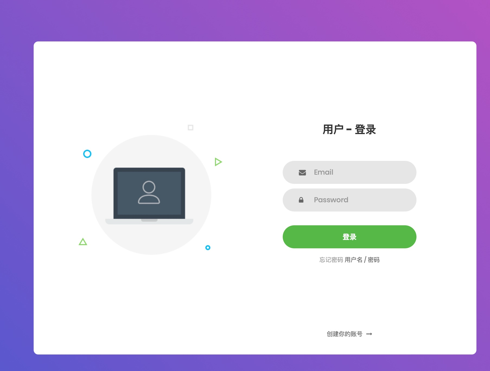
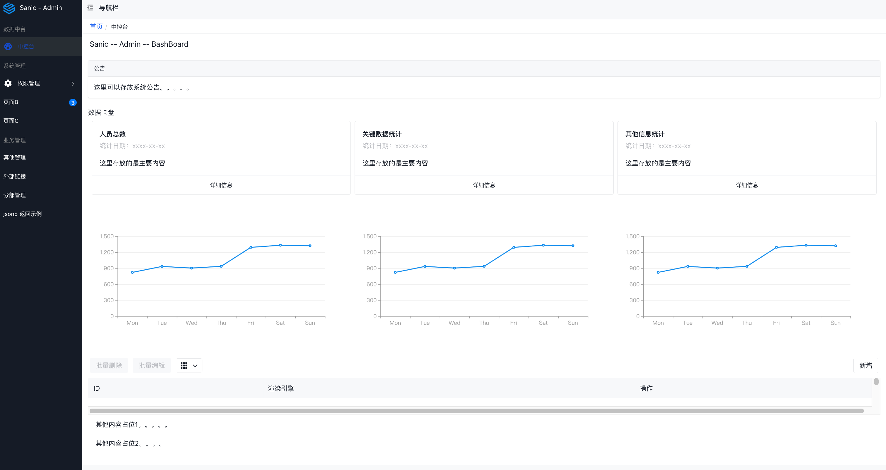
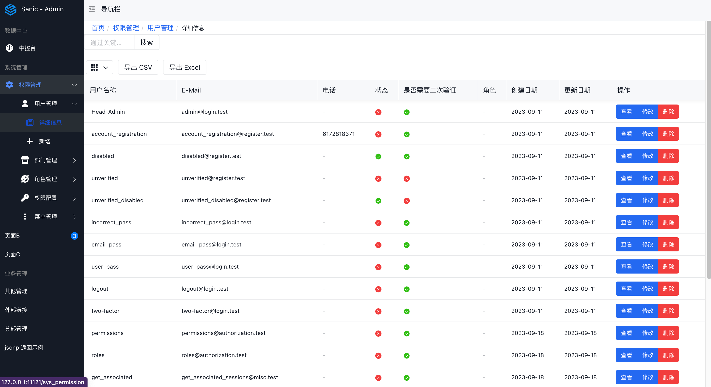
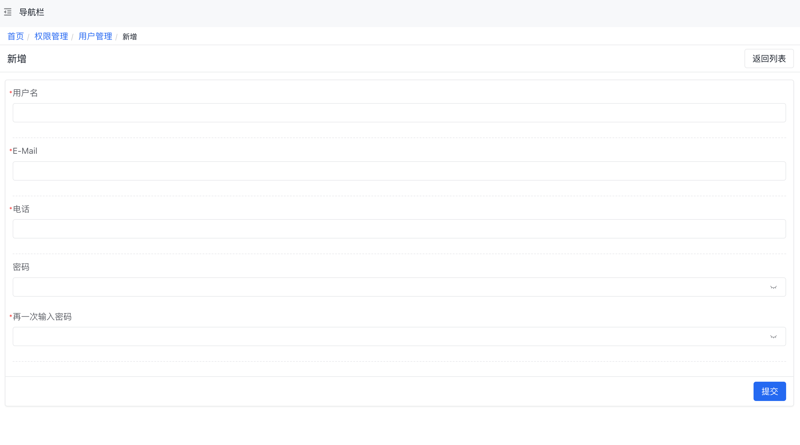
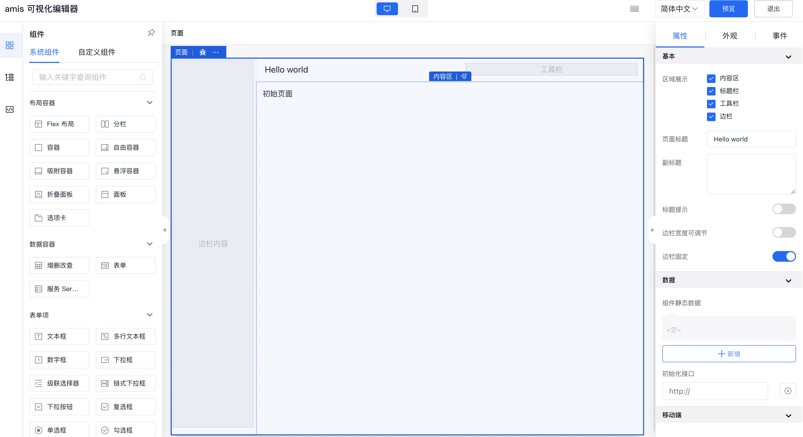
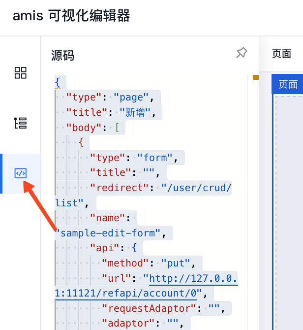
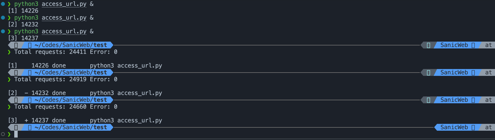
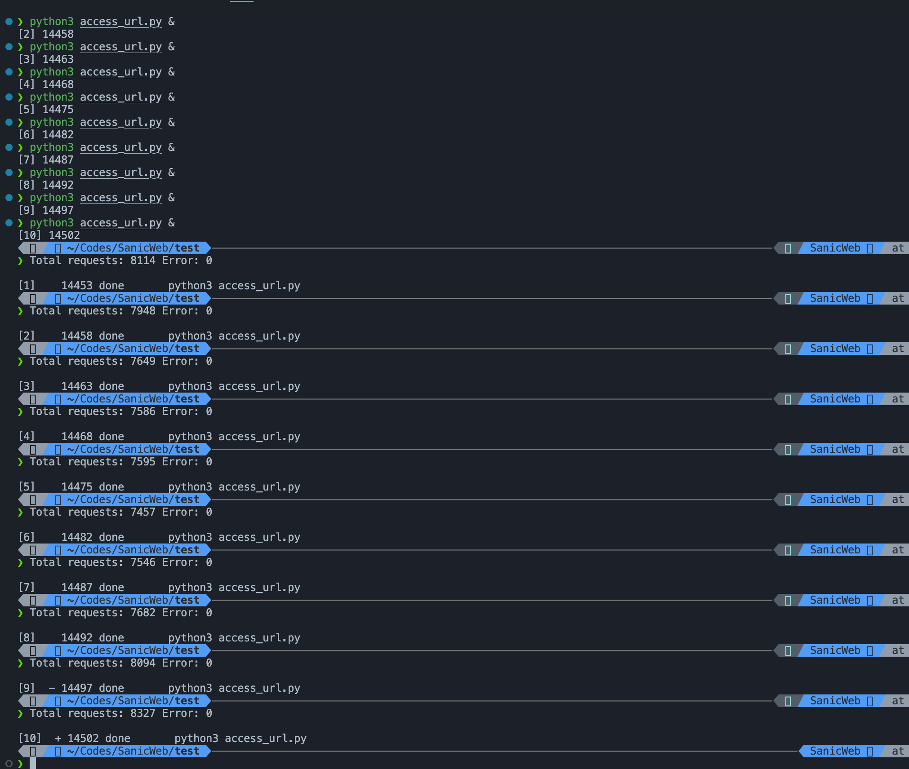

以下是文档信息的英文翻译：

# SA-Admin

Built on **Sanic** and leveraging the low-code framework **AMIS** for the frontend, SA-Admin simplifies frontend configuration for backend developers. With the power and lightweight nature of Sanic, it allows the backend manager to cover a wider range and achieve stronger functionality.









## Installation

Currently, there is no PyPI installation method available. You can clone the repository to your local environment and run it directly:

```python
python3 main.py
```

This will run and debug the application.

## Usage

To use SA-Admin, you need to have a basic understanding of Sanic or Flask. The framework is loosely based on Django and uses the Tortoise ORM, Jinja2 templates, and the frontend is built with Baidu's low-code framework, AMIS. AMIS is a convenient frontend framework, but it may require some time to familiarize yourself with. With it, you can control the frontend pages directly using JSON.

The code includes comments that you can refer to directly.

Specific usage:

1. Database Configuration

   Database configuration is in the `main.py` file. If you need to switch to a different database, it is recommended to change it to MySQL or PostgreSQL because Tortoise supports asynchronous calls to these two databases directly, and the speed is really impressive.

   ```python
   sa_config.TEST_DATABASE_URL = "sqlite://security_test_db.sqlite3"
   ```

2. Administrator Configuration

   The initial password for the administrator is `SAdmin: SAdmin@123`. If you need to change it to your own password, please modify the parameter.

   ```python
   sa_config.INITIAL_ADMIN_PASSWORD = "SAdmin@123"  # Password used when creating the initial admin account
   ```

3. Configure the port and run the command

   If necessary, you can change the port:

   ```python
   app.run(
       host="127.0.0.1",
       port=22222,
       workers=1,
       debug=True,
       auto_reload=True
   )
   ```

   Command Explanation:

   - `workers=1`: This configures multi-task processing. However, in high-concurrency situations, due to the time-consuming switch between parallelism and asynchronous operations, it may be slower than a single instance. If needed, it is recommended to run multiple processes, but for now, it's better not to use `workers`. The choice depends on the actual scenario.

   - `auto_reload=True`: This enables automatic reloading, which is very useful. You don't need to manually reload when you make code changes.

4. Design the frontend AMIS using an editor

   For the first time using AMIS, take some time to read the AMIS documentation and understand how to use its components. I spent three days reading the documentation and getting familiar with various components.

   You can directly use the AMIS online editor for interface design:

   AMIS Editor:

   [https://aisuda.github.io/amis-editor-demo/#/hello-world](https://aisuda.github.io/amis-editor-demo/#/hello-world)

   

5. Edit the frontend components and copy the code directly.

   

6. In the frontend code area, create a JSON file and paste the code.

7. Reference the newly created code in the main framework.

   The main framework file is `./admin/pages/site.json`. To modify and reference it:

   - Copy the entire main framework code.
   - Go to the AMIS editor, create a new page, paste the code, and add a column according to your preferences.
   - After editing, copy it back to `site.json`. Modify the `data` section to `"schema": {}`, which represents the content on the right side of the page.

You can also refer to my approach by saving the content of the newly added page as a separate JSON file and referencing it using `schemaApi`. Please refer to the `site.json` file for details.

Below is the JSON format for AMIS:

```json
{
  "status": 0,  // Required item in the response
  "msg": "",    // Required item in the response
  "data": {     // JSON representing the elements of the page
    "pages": [
      {           // Title layer for the navigation bar
        "label": "Home",
        "url": "/",  // URL for this layer to facilitate navigation to other layers
        "redirect": "/login"  // What page to navigate to when the page initializes
      },
      {
        "label": "Function Navigation",  // This layer becomes the navigation bar
        "children": [                   // Column layer for the navigation bar
          {
            "label": "Login/Register",
            "url": "login",
            "schema": {}  // The content here represents the content on the right side of the page
          },
          {
            "label": "The number of items here represents the number of columns in the navigation bar",
            "url": "login",
            "schema": {}  // The content here represents the content on the right side of the page
          }
        ]
      }
    ]
  }
}
```

## Final Notes

This is a simple admin management interface. Please modify it according to your specific needs. With AMIS's features, it can roughly meet 90% of the requirements for admin management interfaces. For the remaining 10%, you may need some assistance from a frontend UI.

### Performance Notes

I tested it with ApiPost7, but the results were not as ideal as others have claimed. It might be due to the use of multiple workers. I wrote a 60-second asynchronous request test [./test/access_url.pu], and the approximate number of requests handled by one process is between 20,000 and 26,000, with no packet loss. The request rate is approximately 400 requests per second under Sanic's processing.

When I ran three processes simultaneously, the number of simultaneous requests dropped to about 14,000, so I'm not sure if it's due to resource limitations on my laptop (Macbook14 M1) or something else. If you have sufficient resources, you can use my code or improve it and conduct further testing. On average, it's a stress load of about 2,300 requests per second, which I think is quite good for an admin dashboard.



When I ran ten processes, the number of simultaneous requests remained at around 14,000, with no errors.


